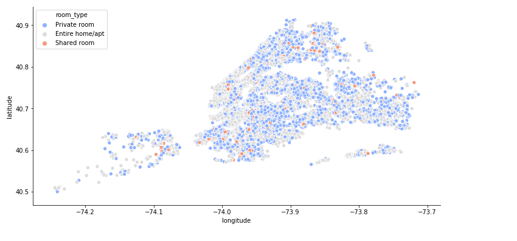

# New York City Airbnb Prediction
## Introduction
Since 2008, guests and hosts have used Airbnb to expand on traveling possibilities and present more unique, personalized way of experiencing the world. This dataset describes the listing activity and metrics in NYC, NY for 2019.

## Background
In doing this project, I wanted to experiment and do a deep dive into the Airbnb's hosted in one of the most electric cities. As New York City is a city I want to explore one day, I decided to do some analysis and price predictions using different regression models on Airbnbs.
- What can we learn from predictions? (ex: locations, prices, reviews, etc)
- Is there any noticeable difference of traffic among different areas and what could be the reason for it?
- In which part of NYC is the airbnb most affordable?

These are some of the questions I will answer in my analysis.

## Findings
- Below is are some graphs of airbnb's separated by each neighbourhood group (Manhattan, Brooklyn, Bronx, and Staten Island) and Room Types (Entire homes, private rooms, shared room)

For a deeper understanding and analysis on this project, please refer to the notebook [here](https://github.com/jason-huynh83/NYC-2019-airbnb/blob/master/nyc_airbnb.ipynb)

## Conclusion
- From the prediction models I've developped I was able to conclude that the neighbourhood definitely has an impact on price. It was found to be more expensive to rent an Airbnb in Manhattan rather than anywhere else in NYC. From the model, it was said to be around $42 more expensive to rent an airbnb in Manhattan. 
- The results can be shown in this dataframe below. To interpret these results, it can be said that for holding all variables fixed, a rent for an airbnb in Manhattan would cost you $42 more.

- In addition, throughout this project, the most highly populated airbnb area was Manhattan. This makes sense as Manhattan is one of the most popular neighbourhoods and attracts significant amounts of tourists each year.
- This question is a little more subjective in terms of affordability. It depends on what you're looking for, however, speaking in terms of just price, through this analysis it can be concluded that renting a shared room in Staten Island would cost you the least amount of money.
